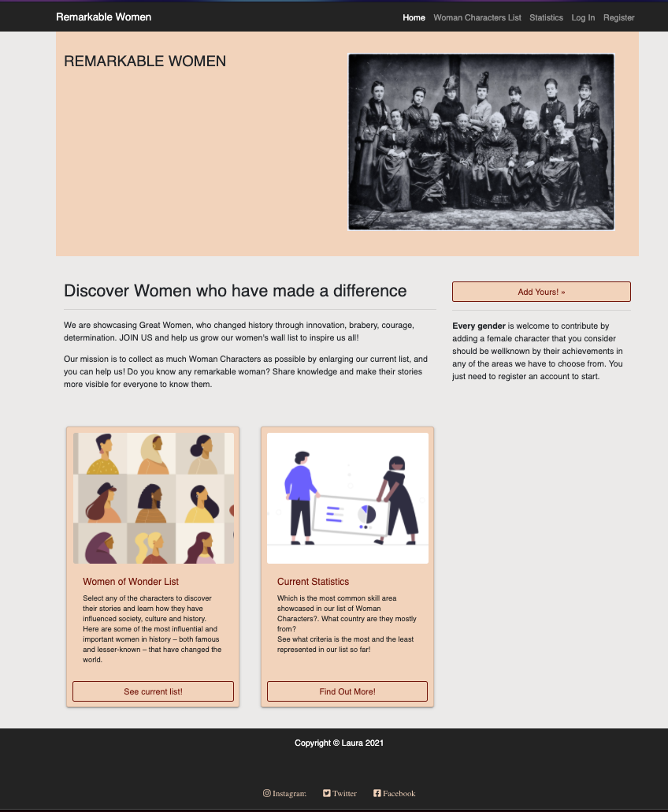

# REMARKABLE WOMEN

</img>

The Third milestone project from the Full Stack Developer course with Code Institute. The project is made based on the second module of the course that covers HTML, Python, MongoDB, Flask, Jinja templating and Heroku deployment.
This is a website which aim is to create present and enlarge a list of remarkable women from any area, historical or fictional even female myths, so the user can register and log in, and add a new woman character by filling some fields in a form.
Basically the database will be composed by that list of women characters created by all users, visible to everyone, but characters are only editable by the owners of each character.


## Contents: 

- UX 
    - Project Goals
    - User Stories/ Goals
    - Site Owner Goals

- Design Choices 
    - Fonts
    - Icons
    - Colours
    - Images

- Requirements

- Planning
    - Website Layout
    - Database Design

- Features 
    - Features included
    - Future Development

- Technologies Used

- Testing:

- Known Issues

- Deployment
	- Deploying to Heroku
    - Locally run this project

- Credits

- Disclaimer

## User Experience:

### Project Goals:
The final goal is to have as many as possible female characters added and share their stories so everyone can know about them, so make sure to add your favourites to your personal list as well!

### User Stories/Goals:
- To find out information about female characters.
- Users make use of the site to share their own known characters with the community, and benefit from having access to the data provided by all other members as they can store any character within their favourites when they register and create an account.
- Contribute to changing the current statistics by adding characters types that might be less represented in the list.

### Site Owner Goals:
- Generate increased interest for the female stories and make them welknown.
- Collect user information in terms of statistics.
- The site owner can potentially be a regular user themselves as might also benefit from the collection of the dataset as a whole.


## Design Choices:
The design of this website had to reflect the historical and cultural influence of these female characters. I chose contrasted colours tending to grey and salmon as they remind to newspapers to be contrasted with blakish and granates. 

### Fonts:
I chose to use sans-serif and monospace families for clear layout for the content on the website. No further design here.

### Icons:
All icons are from font-awesome toolkit site used through cdn link included in the head of the base template.

### Colours:
- #ebeae9 For light grey body background and some texts.
- #ffd1b9 Cards and header backgrounds used in all pages.
- #232323 Used for contrasts elegantly with the primary colours and provides a clear option to use on elements like navigaton.
- #880000 provides contrasts in texts and links.

### Images:
The images chosen relate to historical pictures and simple geometric-type draws design related to each topic they present and they are only used in the home page. The rest of the images belong to the characters when the users create them.
Sources:

<a href="https://www.historybyzim.com/wp-content/uploads/2018/01/International-Council-of-Women-in-Washington-DC-in-March-1888..jpg">Home image </a>

<a href="https://centaur-wp.s3.eu-central-1.amazonaws.com/designweek/prod/content/uploads/2020/03/06144715/banner-4.jpg">Home section image</a>

<a href="https://undraw.co/">Statistics at home page Open-source illustrations</a>


#### Requirements:
Whenever installing new packages, the requirements.txt file must be updated so that Heroku knows we require more to run the app.
    
Packages:
    The following packages have to be imported at the beggining of app.py file:

    * flask: Using the following: flash: to show text messages after a function is executed.
    
    * render_template: Allows Flask look inside the templates directory to find the HTML files referenced in the return of the functions.

    * redirect: to use with routing will redirect to a particular function in our Flask app.

    * request: when a function is called, to set conditions for the requested method GET or POST

    * session: to be able to use session() functions to put the user into 'session', like a temporary page cookie.

    * url_for: method to target Python functions name and to point to actual root of a file name.

    * flask-pymongo : Third-party library to get Flask to communicate with MongoDB Atlas.

    * dnsython: package to use the Mongo SRV connection string.

    * bson.objectid: MongoDB stores its data in a JSON-like format called BSON. In order to find documents from MongoDB, we need to be able to render the ObjectId

    * flask-paginate using import Pagination, get_page_args in order to display pagination functionality in the list of characters. 
    Documentation can be found:

    <a href="https://pythonhosted.org/Flask-paginate/">here</a>

    <a href="https://gist.github.com/mozillazg/69fb40067ae6d80386e10e105e6803c9">here</a>

    * werkzeug.security : to make user authentication more secure using two main helpers "generate_password_hash", and "check_password_hash" that allow converting the user's password into another string, it will then salt that string with random data

    * env : to grab the hidden environment variables, only if env.py file exists in our root directory.
    
Database MONGODB Connection:

Navigate to 'mongodb.com create an account and after loggin in, start by creating a Cluster service that our database will run on.

select a Cloud provider and your closest region.

For thi project, there is no need to pay for a database, the free tier is enough, choose the M0 Tier.

Then, select 'Cluster Name' and click on the 'Create Cluster' button.

click on 'Database Access' under the Security section on the left, in order to create our database user credentials.

Click on 'Add New Database User', to create username and password.

Set user privileges to 'Read and Write to the Database', and then we can click 'Add User'.

click on 'Network Access' within the Security menu, in order to whitelist our IP address and make sure that it has access to our database.

Click 'Add IP Address', and select 'Allow Access From Anywhere.

Put the IP addresses of your hosts here, if possible, if not, choose 0.0.0.0

Go back to Clusters tab, click on the 'Collections' button, click 'Add My Own Data' to create the database.

For the statistics section, you need to have MongoDB Charts connected to your database in Mongosite. The following documentation is available for it:
    <a href="https://docs.mongodb.com/charts/onprem/installation"></a>
    <a href="https://www.mongodb.com/blog/post/visualizing-your-data-with-mongodb-charts"></a>
    <a href="https://docs.mongodb.com/charts/onprem/embedding-charts"></a>

Countries list imported into countries collection in MongoDB:
    The list was imported from this source:
     <a href="https://stackoverflow.com/questions/13678901/word-cities-towns-countries-database-for-mongodb-or-in-json"></a>
    This was done automatically for this project using RoboMongo which is a MongoDB GUI available <a href="https://robomongo.org/">here</a>
    Just have to donwload it and connect it to your MongoDB following the documentation from the site.
    

#### Planning:

The initial idea was to have not many sections and a simple layout so no wireframes were used and not many navigation options included as it should be focussed on the database and having the following expected functions:
    - Navigation depends on if user is logged or not and type of user (admin or normal)
    - The website protects the users information by registering and security functionality derived from werkzeug package.
    - The users can interact with the elements visible on the page, by adding new characters in a form, editing the ones they have already created or adding others to their favourites collection. The admin additionally can edit/create/delete category and skill area fields.
    - The website loads all fields and sections
    - The content on the website renders responsibly.
    - The users feel informed and satisfied with the informaton available.

    ### Database Design:
    The following collections:
    - categories
    - countries
    - skilled_area
    - users
    - woman_card


categories Collection:
**Title**|**Key in Collection**|**Data Type**
:-----:|:-----:|:-----:
category Id|_id|ObjectId
Name|category_name|String

countries Collection:
**Title**|**Key in Collection**|**Data Type**
:-----:|:-----:|:-----:
country ID|_id|ObjectID
country code|country_code|String
country name|country_name|String

skilled_area Collection:
**Title**|**Key in Collection**|**Data Type**
:-----:|:-----:|:-----:
area Id|_id|ObjectId
Name|area_name|String

Users Collection:
**Title**|**Key in Collection**|**Data Type**
:-----:|:-----:|:-----:
User ID|_id|ObjectID
Name|username|String
Password|password|String
Favourites|favourites|array

woman_card Collection:
**Title**|**Key in Collection**|**Data Type**
:-----:|:-----:|:-----:
woman card Id|_id|ObjectID
Category Name|category_name|String
Name|woman_name|String
year of birth|year|String
country name|country_name|String
quote |quote|String
Image|image|String
Area Name|area_name|Array
link|more_link|String
User Name|username|String


## Features:

### Features Included:
- User registration (register function) and autentication (login function)
- Navigation visible options conditioned to type of user and to registered/logged and not registered user.
- Unregistered user can just read and navigate through the following: Home, character list, statistics, log in, register
- Regular logged/registered user can additionally navigate to the Add New Character menu where they can add, edit, delete characters created by them through filling a form, and they can mark/save favourite any character in the characters list to their profile.
- Admin user can additionally see an adminmanage section that allows them add, edit, delete category fields and skill area fields from the characters creation form.The changes the admin makes in any of these options are reflected in the form for creating a new character and will show there. However if the admin deletes a category or an area, those will still exist for characters already created before with those categories or areas selected.
- Filter through characters category in the characters list
- Search by any word in the characters list.
- Statistics graphs embeded from MongoDB to see what criteria is the most and the least represented currently from all the characters added.

### Future Development:
- An option for users to opt-in to a mailing list to keep up to date with the latest additions.
- Email authentication to provide a second level of security, so they get their login details can be confirmed and/or recover account.
- Another filter by skill area not just by category.
- Double check password confirmation in registration.
- Set user types to be able to have several admin users by adding if user = is_admin condition and not just one admin.

## Technologies Used:
#### Languages:
* <a href="https://html.spec.whatwg.org/multipage/">HTML</a> Basic structure for the site
* <a href="https://www.w3.org/Style/CSS/Overview.en.html">CSS</a> Styling the website and customising bootstrap classes
* <a href="https://www.json.org/json-en.html">JSON</a> database format
* <a href="https://www.python.org/">Python</a> All functions backend

#### Tools & Libraries: 

* <a href="https://jquery.com/">jQuery</a> For toggler button in characters cards.
* <a href="https://getbootstrap.com/">Bootstrap</a> responsive layout mobile-first mainly used for grid structure and buttons
* <a href="https://fontawesome.com/icons?d=gallery">Font-Awesome</a> Icons
* <a href="https://www.mongodb.com/cloud/atlas">MongoDB Atlas</a> Database of all characters
* <a href="https://docs.mongodb.com/charts/saas/">MongoDB Charts</a> Adding graphs connected to the data base to be shown in statistics section
* <a href="https://pymongo.readthedocs.io/en/stable/">PyMongo</a>
* <a href="https://flask.palletsprojects.com/en/1.0.x/">Flask</a>
* <a href="https://jinja.palletsprojects.com/en/2.10.x/">Jinja</a>

## Testing:

A the scope of this project website is not too big, testing has been made when adding any new function every time and using Google Chrome inspect for responsive layout.

#### Bugs and tests during development: 

<p>Being new to all of these technologies and having just 4 weeks deadline has made this project a real challenge and took longer to find solutions and fixes.</p>

* <strong>The email field </strong> in the user registration section was included time after some users and character records were already in the database, so it affected all the previous users created until then.
* <strong>Search and filter </strong>functions were affected when adding pagination package functionality in a later stage of the project, since the search and filter scope work in all characters data and some of the characters were showing in a several pages once the pagination was included.
* <strong>Admin option to edit </strong>categories and skill area fields were throwing some undefined variable errors since both options redirect to the same page.
* <strong>Pagination packcage </strong>affected heroku deployment since any new packcage has to be added in the requirements file.
* <strong>Active Navigation </strong>highlighted menu wasn't possible without adding additional flask blocks on each template, since the navigation section is fully contained in the base.html template only.
* <strong>Referenced links </strong>to internal static files have to be referenced through flask url_for format and not the frontend usual form.
* <strong>Any new character created/deleted or edited</strong>, and any new field created/deleted or edited was always checked in console responses and MongoDB changes reflected.
* <strong>Any new feature function addition </strong>was also checked if required to be added in MongoDB fields collection.
* <strong>All changes in layouts </strong>were checked on the go by seeing the visual effect and using google inspector.


## Known yet unsolved issues/bugs

- If a user deletes a character that he has created and this character is in someone’s fav list, profile throws error as can’t find character_id and requires fixing in from MongoDB.
- If the Admin user adds a new category, that can not be updated automatically in the characters.html category filter since the filter works by literal category name, so the new category name should be amnually added and the admin to inform of that to be updated.
- When adding a new character, the skills area field input data gets saved with these  brackets [] added, and can only be removed manually from MongoDB.
- Since there is currently only one admin user, in order to anyone to try the admin functionalities I have to provide the admin login details for them.


## Deployment 🚀

Remarkable Women was developed on GitPod, repository hosted in Github and deployed in Heroku.
As GitHub Pages only allows us to host static websites, can't host a Python project.

Deployment was made through Heroku host provider connected to gitHub.

Process:

On GitPod create a file env.py which will contain the secret environment variables, this file is hidden from Github.

It contains the folloing lines of code:

import os

os.environ.setdefault("IP", "")

os.environ.setdefault("PORT", "")

os.environ.setdefault("SECRET_KEY", "")

os.environ.setdefault("MONGO_URI", "")

os.environ.setdefault("MONGO_DBNAME", "task_manager")

on the "" on each line include the corresponding values for each.

IP can use default value 0.0.0.0

PORT will use the standard port used for Flask applications, which is "5000".

SECRET_KEY is required whenever using the flash() and session() functions of Flask, choose one.

It is also necessary to connect the MongoDB database in order to get the MONGO_URI value.

On Mongo website click on 'Clusters' in the left-hand menu, then from Cluster sandbox, click 'Connect'.

I didn't need to install the mongo shell, but you might need to if you're working locally on your own set.

Select 'Connect your Application', choose Python for the driver, and the appropriate version for your setup.

It's generated the command for us to use, it contains our username and cluster details already, the only thing we need to modify in the string is update the database name and password on the <>. Remove the angle-brackets placeholder.

mongodb+srv://username:@myclustername.qgyym.mongodb.net/?retryWrites=true&w=majority the username and password comes from the Database Access page section on the MongoDB website.

Create Heroku account on heroku.com/

Before creating the Heroku application, setup some files that Heroku needs to run the app.

First, on Gitpod command line tell Heroku which applications and dependencies are required to run the app by creating the requirements.txt file.

This app require the following in requirements.txt:
```bash
click==7.1.2

dnspython==2.0.0

Flask==1.1.2

flask-paginate==0.7.1

Flask-PyMongo==2.3.0

itsdangerous==1.1.0

pymongo==3.11.2

Werkzeug==1.0.1
```
Next, create the Procfile that Heroku looks for to know which file runs the app, and how to run it. The file contains the following: web: python app.py

On Heroku website once logged in, on the dashboard click on the "Create New App" button, provide a unique app name and select the region closest to you.

Once created Heroku offers 3 deployment methods:Heroku CLI, Github connect and Container.

We've chosen connect it to GitHub. which sets up Automatic Deployment from our GitHub repository. Add your repository name, then click 'Search'.

Once it finds your repo, click to connect to this app.

Before clicking to Enable Automatic Deployment, since the environment variables are contained within a hidden env.py file, Heroku won't be able to read those variables.

Click on the 'Settings' tab, and then click on 'Reveal Config Vars', where we can securely tell Heroku which variables are required: (IP, PORT, SECRET_KEY and MONGO_DBNAME which is the name of our database, that is task_manager in this case)

On GitPod command line push our two new files to the GitHub repository (requirements.txt and Procfile)

Back to Heroku website on the 'Deploy' tab, click 'Enable Automatic Deployment' only has the main branch for the project, so click 'Deploy Branch'.

Heroku will now receive the code from GitHub, and start building the app using our required packages.

you'll also see "Your app was successfully deployed."

Click "View" to launch the new app.

the deployed site is now available, and will automatically update the push changes to the GitHub repository.

### Cloning from GitHub:

Install the following:
* PIP
* Python 3

Create an account at <a href="https://www.mongodb.com/">MongoDB</a> in order to construct the database.


* 1: Clone the repository by either downloading from <a href="https://github.com/laumartin/RemarkableWomen"> here</a>, or if you have Git installed typing the following command into your terminal.
```bash
git clone https://github.com/laumartin/RemarkableWomen
```
* 2: Navigate to this folder in your terminal.
* 3: Enter the following command into your terminal.
```bash
python3 -m .venv venv
```
* 4: Initilaize the environment by using the following command.
```bash
.venv\bin\activate 
```
* 5: Install the relevant requirements & dependancies from the requirements.txt file.
```bash
pip3 -r requirements.txt
```
* 6: In your IDE create a file where you can store your SECRET_KEY and your MONGO_URI, follow the schema structure already described in deployment section above.

* 7: Run the application using 
```bash
Python3 app.py
```

### Deploying to Heroku:

* Create Heroku account on heroku.com/ But before creating the Heroku application, setup some files that Heroku needs to run the app.
First, on Gitpod command line tell Heroku which applications and dependencies are required to run the app by creating the requirements.txt file.
```bash
pip3 freeze > requirements.txt
```
* Create the Procfile that Heroku looks for to know which file runs the app, and how to run it. The file contains the following
```bash
echo web: python3 app.py > Procfile
```
* Have these files in your repository.
* On Heroku website once logged in, on the dashboard click on the "Create New App" button, provide a unique app name and select the region closest to you.
* Select deployment method Heroku offers 3 deployment methods:Heroku CLI, Github connect and Container. Click on the deployment method button and select GitHub which sets up Automatic Deployment from our GitHub repository. Add your repository name, then click 'Search'.
Once it finds your repo, click to connect to this app.
* Before clicking to Enable Automatic Deployment, since the environment variables are contained within a hidden env.py file, Heroku won't be able to read those variables.

Click on the 'Settings' tab, and then click on 'Reveal Config Vars', where we can securely tell Heroku which variables are required: (IP, PORT, SECRET_KEY and MONGO_DBNAME which is the name of our database. On the dashboard set the following config variables:

**Key**|**Value**
:-----:|:-----:
IP|0.0.0.0
PORT|5000
MONGO\_URI|mongodb+srv://<username>:<password>@<cluster\_name>-qtxun.mongodb.net/<database\_name>?retryWrites=true&w=majority
SECRET\_KEY|"your\_secret\_key"

the username and password comes from the Database Access page section on the MongoDB website.

* Back to Heroku website on the 'Deploy' tab, click 'Enable Automatic Deployment' only has the main branch for the project, so click 'Deploy Branch'.
* Heroku will now receive the code from GitHub, and start building the app using our required packages, you'll also see "Your app was successfully deployed."
Click "View" to launch the new app.

The deployed site is now available, and will automatically update the push changes to the GitHub repository.

## Credits

* <a href="https://www.historybyzim.com/wp-content/uploads/2018/01/International-Council-of-Women-in-Washington-DC-in-March-1888..jpg">Images Sources</a>
* <a href="https://centaur-wp.s3.eu-central-1.amazonaws.com/designweek/prod/content/uploads/2020/03/06144715/banner-4.jpg">Images Sources</a>
* <a href="https://undraw.co/">Images Sourcesstatistics at home page Open-source illustrations</a>
* <a href="https://stackoverflow.com/questions/13678901/word-cities-towns-countries-database-for-mongodb-or-in-json">The countries list was imported from this source</a>


## Disclaimer
The focus in this project is on the data and contents are for educational purposes only, rather than any business logic.
